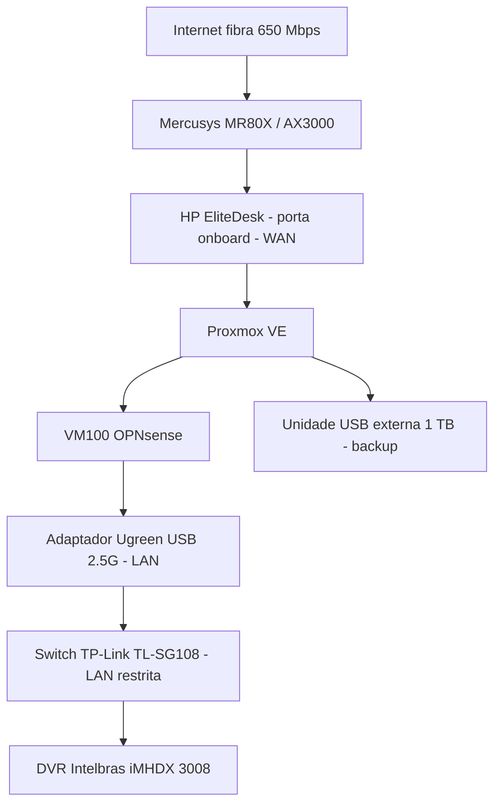
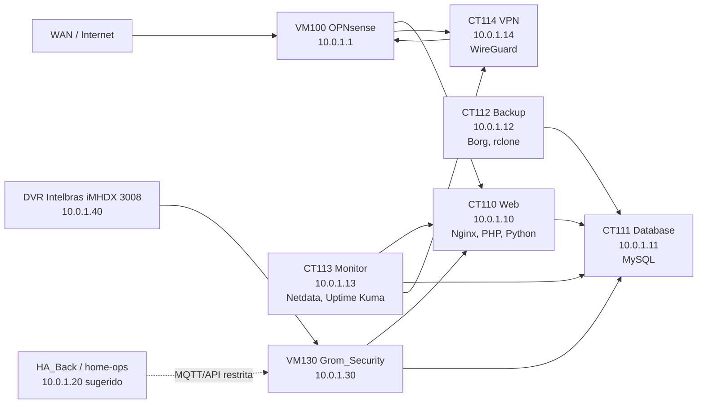
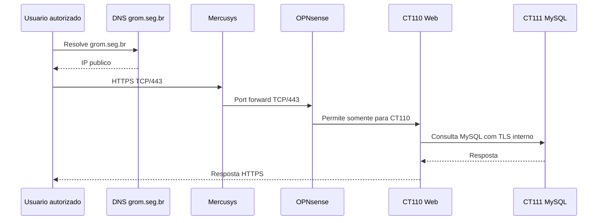
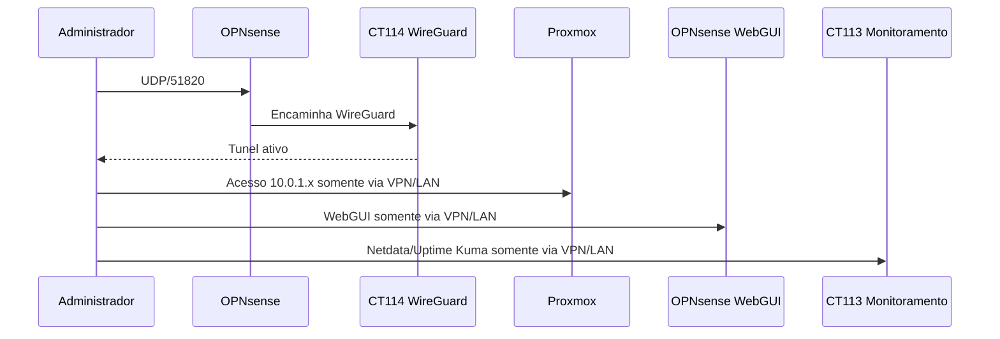
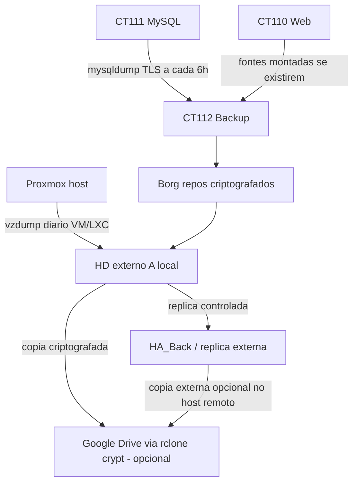
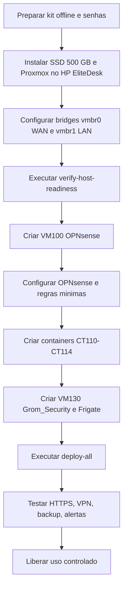

# Diagramas e matrizes operacionais

Este documento consolida a topologia, os fluxos e as matrizes que devem orientar a implantacao do Grom Server. A regra central e simples: somente HTTP/HTTPS e VPN podem atravessar a borda publica; todo o resto fica em LAN restrita ou VPN.

Escopo atual:

- este documento permanece como visao arquitetural do `hp-core` e da
  integracao entre hosts;
- o detalhamento operacional da segunda maquina `home-ops` pertence ao projeto
  `HA_Back`.

## Topologia fisica - Fase 1

Observacoes:
- O roteador Mercusys deve encaminhar apenas as portas aprovadas para o OPNsense.
- O switch atual nao faz VLAN; por isso, a rede fisica ligada nele deve ser tratada como zona restrita.
- Equipamentos de visitantes, IoT, cameras e dispositivos desconhecidos nao devem entrar nesse switch.

## Topologia logica

## Fluxo publico HTTPS

Controles obrigatorios:
- TLS valido via Let's Encrypt.
- Headers de seguranca no Nginx.
- Logs de acesso sem gravar conteudo sensivel.
- Banco acessivel somente por IPs internos autorizados.

## Fluxo administrativo por VPN

Controles obrigatorios:
- Um peer WireGuard por pessoa/dispositivo.
- Revogacao imediata ao trocar aparelho, desligar colaborador ou suspeitar vazamento.
- Proxmox, OPNsense, SSH, MySQL e monitoramento nunca publicados na internet.

## Fluxo de backup

Regras:
- Google Drive e apenas copia externa criptografada, nunca backup principal.
- A unidade USB de 1 TB e backup, nao armazenamento de gravacao continua.
- O `HA_Back` deve receber replica adicional da unidade USB/CT112.
- O primeiro restore deve ser testado antes de inserir dados reais.
- Chaves Borg, senha Borg e senha do rclone crypt ficam fora do repositorio.
- O restore drill do lado remoto e documentado no `HA_Back`.

## Sequencia de implantacao

## Matriz de hosts

| ID | Nome | IP | Exposicao | Funcao | Acesso administrativo |
|---|---|---:|---|---|---|
| Host | Proxmox | LAN/host | Nao publico | Hypervisor | VPN/LAN |
| VM100 | opnsense | 10.0.1.1 | 80/443/51820 via NAT conforme regra | Firewall, DNS, DHCP | VPN/LAN |
| CT110 | grom-web | 10.0.1.10 | 80/443 via OPNsense | Nginx, PHP, Python, Grom.Seg | VPN/LAN/SSH restrito |
| CT111 | grom-db | 10.0.1.11 | Nao publico | MySQL | VPN/LAN/SSH restrito |
| CT112 | grom-backup | 10.0.1.12 | Nao publico | Borg, dumps, rclone | VPN/LAN/SSH restrito |
| CT113 | grom-monitor | 10.0.1.13 | Nao publico | Netdata, Uptime Kuma | VPN/LAN |
| CT114 | grom-vpn | 10.0.1.14 | UDP/51820 | WireGuard | VPN/LAN/SSH restrito |
| Externo | home-ops / HA_Back | 10.0.1.20 sugerido | Nao publico | Home Assistant, replica dos backups do HP e automacoes | VPN/LAN |
| VM130 | grom-security | 10.0.1.30 | Nao publico | Frigate, MQTT, video, OCR, eventos e alertas | VPN/LAN |
| Fisico | DVR Intelbras iMHDX 3008 | 10.0.1.40 sugerido | Nao publico | Gravacao continua e origem de streams | VPN/LAN restrita |

## Matriz de portas

| Origem | Destino | Porta | Protocolo | Acao | Motivo |
|---|---|---:|---|---|---|
| Internet | OPNsense WAN | 80 | TCP | Permitir se web publico ativo | Emissao TLS e redirecionamento HTTP |
| Internet | OPNsense WAN | 443 | TCP | Permitir | HTTPS publico dos sistemas |
| Internet | OPNsense WAN | 51820 | UDP | Permitir se VPN ativa | WireGuard |
| Internet | Proxmox | 8006 | TCP | Bloquear | Administracao nao publica |
| Internet | OPNsense WebGUI | 443 | TCP | Bloquear | Administracao nao publica |
| Internet | CT111 MySQL | 3306 | TCP | Bloquear | Banco interno |
| Internet | CT113 Monitor | 19999/3001 | TCP | Bloquear | Monitoramento interno |
| CT110 Web | CT111 DB | 3306 | TCP | Permitir com TLS | Aplicacoes acessam banco |
| CT112 Backup | CT111 DB | 3306 | TCP | Permitir com TLS | Backup logico |
| CT113 Monitor | CT110/CT111/CT114 | portas de servico | TCP/ICMP | Permitir minimo | Monitoramento interno |
| HA_Back / home-ops | VM130 Grom_Security | 1883/API conforme desenho | TCP | Permitir restrito quando integrado | MQTT/eventos |
| VM130 Grom_Security | CT110/CT111 | 443/3306 conforme desenho | TCP | Permitir restrito | API/eventos/banco |
| VM130 Grom_Security | DVR/cameras | RTSP/ONVIF conforme equipamento | TCP/UDP | Permitir restrito | Streams de video e descoberta |
| Internet | DVR/cameras | Qualquer | TCP/UDP | Bloquear | Sem exposicao publica |
| VPN/LAN admin | Proxmox/OPNsense/containers | 22/443/8006 conforme host | TCP | Permitir restrito | Manutencao |

## Matriz de exposicao publica

| Servico | Publicar? | Condicao |
|---|---|---|
| `grom.seg.br` | Sim | Entrada principal do Grom.Seg, somente HTTPS e autenticacao da aplicacao |
| `web.grom.seg.br` | Temporario | Legado/transicao |
| `docs.grom.seg.br` | Temporario | Legado/transicao |
| `vpn.grom.seg.br` | Sim | Somente UDP/51820 |
| Proxmox | Nao | VPN/LAN apenas |
| OPNsense WebGUI | Nao | VPN/LAN apenas |
| MySQL | Nao | CT110/CT112 apenas |
| Netdata | Nao | VPN/LAN apenas |
| Uptime Kuma | Nao | VPN/LAN apenas |
| SSH | Nao | VPN/LAN apenas |

## Matriz LGPD

| Dado | Local previsto | Controle minimo |
|---|---|---|
| Dados pessoais de terceiros | MySQL e arquivos dos sistemas | Controle de acesso, TLS, backup criptografado |
| Boletins e documentos policiais | Grom.Seg / armazenamento da aplicacao | Perfil por usuario, trilha de auditoria, retencao definida |
| Logs de acesso | Web, OPNsense, monitoramento | Sem conteudo sensivel; retencao limitada |
| Backups | SSD, HD externo, Drive criptografado opcional | Borg/rclone crypt, teste de restore, guarda fisica |
| Segredos | `/etc/grom/grom.env`, cofres locais | Nunca commitar, nunca enviar por e-mail |

## Criterio para evoluir para VLAN

Migrar para switch gerenciavel quando pelo menos uma condicao ocorrer:
- Existirem estacoes comuns ou dispositivos de terceiros na mesma rede fisica do servidor.
- Houver necessidade de separar administracao, usuarios, servidores e visitantes.
- O ambiente passar a ter cameras, IoT, impressoras ou equipamentos sem controle de hardening.
- A auditoria exigir segregacao fisica/logica mais forte.

Enquanto isso nao ocorrer, o TL-SG108 atual permanece aceitavel para a Fase 1, desde que usado apenas como LAN restrita do servidor.
