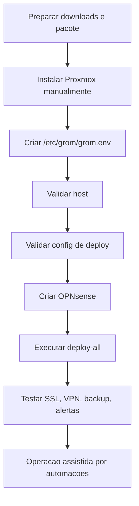

# Automacao e baixa manutencao

Este documento define ate onde o Grom Server deve operar de forma autonoma e onde a intervencao humana continua obrigatoria por seguranca, LGPD ou dependencia fisica.

## Objetivo

Reduzir a operacao manual ao minimo seguro:
- Implantacao repetivel.
- Configuracao documentada.
- Falha cedo quando faltar requisito.
- Alertas automaticos.
- Backups automaticos e testaveis.
- Superficie publica minima.

Automacao nao deve significar ausencia de controle. Em ambiente com dados policiais, os checkpoints humanos existem para impedir exposicao indevida, perda de dados e uso de credenciais fracas.

## Fluxo padrao



## Automacoes existentes

| Area | Automacao | Script/rotina |
|---|---|---|
| Pacote offline | Monta `dist/grom-scripts.zip` ou `.tar.gz` com manifesto e checksum | `scripts/build-release.sh` |
| Downloads | Prepara ISO/template e checksums | `scripts/downloads/prepare-offline-kit.ps1` / `.sh` |
| Host | Valida Proxmox, interfaces, disco e ferramentas | `scripts/proxmox/verify-host-readiness.sh` |
| Deploy | Valida variaveis, pacote e estrutura | `scripts/proxmox/validate-deploy-config.sh` |
| Pos-deploy | Valida VM/CT, servicos, backup e exposicao publica | `scripts/proxmox/post-deploy-validation.sh` |
| Relatorio mensal | Resume host, VM/CT, servicos, backup, logs e checklist | `scripts/proxmox/monthly-operational-report.sh` |
| Orquestracao | Executa gates, deploy, pos-validacao e Go/No-Go | `scripts/proxmox/final-local-deploy.sh` |
| Instalacao principal | Implanta VMs/containers e servicos quando chamado pelo orquestrador | `scripts/deploy-all.sh` |
| Proxmox | Pos-instalacao e backup VM/LXC | `post-install.sh`, `backup-containers.sh` |
| Containers | Criacao CT110-CT114 | `create-containers.sh` |
| Web | Nginx, PHP, Python e SSL | `scripts/webserver/*` |
| Banco | MySQL, usuarios e TLS interno | `scripts/database/setup-mysql.sh` |
| Backup | Borg, dumps, HD externo, rclone crypt opcional | `scripts/backup/*` |
| VPN | WireGuard e clientes | `scripts/vpn/setup-wireguard.sh` |
| Monitoramento | Netdata, Uptime Kuma e watchdog | `scripts/monitoring/setup-monitoring.sh` |
| Seguranca | Hardening, Fail2Ban, relay SMTP | `scripts/security/*` |

## Comando de validacao antes do deploy

No Proxmox, depois de extrair o pacote em `/root/grom-scripts`:

```bash
bash /root/grom-scripts/scripts/proxmox/verify-host-readiness.sh
bash /root/grom-scripts/scripts/proxmox/validate-deploy-config.sh --strict
```

Se qualquer validacao falhar, corrigir antes de rodar o orquestrador.

## Comando de deploy

```bash
cd /root/grom-scripts
bash /root/grom-scripts/scripts/proxmox/final-local-deploy.sh --confirm-final-deploy --public-target=grom.seg.br
```

O `deploy-all.sh` tambem executa `validate-deploy-config.sh --strict` no inicio. Isso reduz risco de instalacao parcial com senhas faltando, pacote incompleto ou variaveis erradas.

## Comando de validacao depois do deploy

```bash
bash /root/grom-scripts/scripts/proxmox/post-deploy-validation.sh
```

Quando DNS/NAT estiverem configurados:

```bash
bash /root/grom-scripts/scripts/proxmox/post-deploy-validation.sh --public-target=grom.seg.br
```

## Intervencao humana obrigatoria

| Etapa | Por que nao automatizar totalmente |
|---|---|
| BIOS e boot Proxmox | Depende do hardware fisico |
| Identificacao de cabos e interfaces | Evita inverter WAN/LAN |
| Senhas e chaves | Segredos nao podem ficar no repositorio |
| OPNsense inicial | Interface WAN/LAN precisa ser confirmada visualmente |
| DNS publico | Depende do provedor do dominio |
| Gmail senha de app | Exige 2FA e autorizacao da conta |
| rclone Google Drive | Exige consentimento OAuth |
| Primeiro restore | Precisa confirmacao humana antes de dados reais |
| Liberacao de producao | Decisao de risco e LGPD |

## Operacao diaria esperada

Sem acao humana diaria:
- Backups de banco a cada 6 horas.
- Backup VM/LXC diario.
- Sync HD externo diario quando montado.
- Sync Google Drive criptografado quando configurado.
- Watchdog a cada 3 minutos.
- Health check periodico.
- Renovacao SSL automatica.
- Atualizacoes de seguranca automaticas.
- Alertas por e-mail quando SMTP estiver ativo.

## Operacao semanal

Responsavel tecnico:
- Conferir se backups rodaram.
- Conferir espaco em SSD e HD externo.
- Verificar alertas recebidos.
- Verificar se portas administrativas continuam fechadas.
- Conferir atualizacoes pendentes no OPNsense.

## Operacao mensal

Responsavel tecnico e gestor:
- Ler o relatorio gerado em `/var/log/grom-reports/`.
- Testar restore de amostra.
- Revisar usuarios das aplicacoes.
- Revisar peers WireGuard.
- Revisar regras WAN do OPNsense.
- Revisar logs de eventos administrativos.
- Verificar se ha necessidade de compra: nobreak, segundo HD, switch gerenciavel.

## Politica de falha segura

Quando houver duvida:
- Nao publicar porta nova.
- Nao colocar dados reais.
- Nao continuar deploy com senha ausente.
- Nao aceitar backup sem restore testado.
- Nao usar Google Drive sem criptografia.
- Nao misturar rede de visitantes/IoT com LAN do servidor.

## Proximas automacoes recomendadas

| Prioridade | Automacao | Beneficio |
|---|---|---|
| Media | Export automatico seguro da config OPNsense | Facilita recuperacao de desastre |
| Media | Integracao UPS/NUT | Desligamento ordenado em queda de energia |
| Media | Rotina guiada de restore | Padroniza recuperacao e reduz erro |

## Aceite de automacao

Considerar a automacao madura quando:
- Deploy limpo executa com um unico comando apos Proxmox/OPNsense base.
- Validadores bloqueiam configuracao incompleta.
- Backups e alertas funcionam sem login manual.
- Restore foi testado.
- Documentacao e scripts estao no mesmo pacote.
- O operador consegue repetir a instalacao seguindo apenas o runbook.
