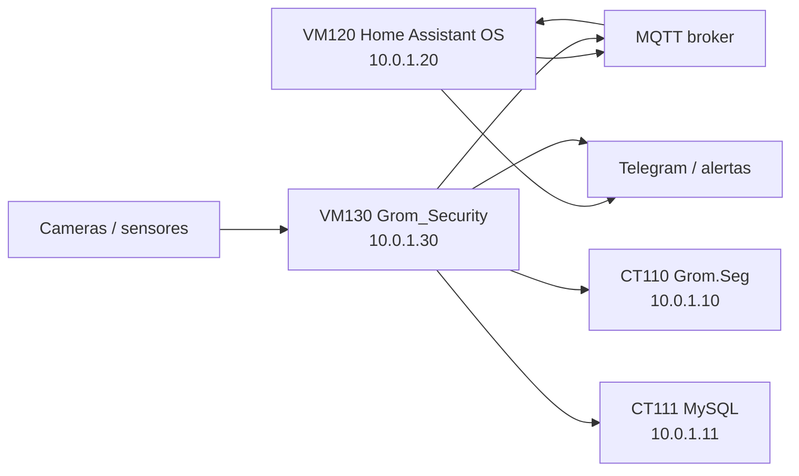

# Home Assistant OS e Grom_Security

Esta readequacao separa automacao residencial/IoT de seguranca operacional. O objetivo e evitar que integracoes de dispositivos, video, OCR e alertas fiquem misturados com o `Grom.Seg` principal.

## Decisao arquitetural

Criar duas VMs dedicadas:

| VM | Nome | IP sugerido | Funcao |
|---|---|---:|---|
| VM120 | home-assistant | 10.0.1.20 | Home Assistant OS e automacoes |
| VM130 | grom-security | 10.0.1.30 | Video, eventos, OCR, API e painel de seguranca |

Manter a infraestrutura base:

| ID | Nome | Funcao |
|---|---|---|
| VM100 | opnsense | Firewall |
| CT110 | grom-web | Grom.Seg |
| CT111 | grom-db | MySQL |
| CT112 | grom-backup | Backup |
| CT113 | grom-monitor | Monitoramento |
| CT114 | grom-vpn | WireGuard |

## Responsabilidades

### VM Home Assistant OS

Executar:
- Home Assistant.
- Matter Server.
- Integracao com Zemismart M6.
- Dashboards.
- Automacoes.
- Alarm Panel.
- Telegram/notificacoes.
- MQTT integration.

Regra: Home Assistant controla automacao e estados de dispositivos. Ele nao deve armazenar evidencias policiais principais nem ser o banco central de eventos sensiveis.

### VM Grom_Security

Executar:
- Docker Compose.
- Mosquitto MQTT, se ficar fora do Home Assistant.
- Frigate ou modulo proprio de video.
- OpenCV.
- OCR de placas.
- Banco de eventos.
- API do Grom_Security.
- Painel operacional.
- Motor de regras.
- Servidor de alertas.
- Snapshots e videos curtos.

Regra: Grom_Security concentra eventos de seguranca, video, OCR e evidencias tecnicas. O `Grom.Seg` consome eventos consolidados por API/banco, sem precisar executar processamento pesado.

## Cameras e DVR

Referencia operacional detalhada:

```text
docs/28-CAMERAS-DVR-VIDEO.md
```

Diretriz adotada:

| Equipamento | Integracao |
|---|---|
| DVR Intelbras iMHDX 3008 | RTSP/ONVIF para o Grom_Security |
| VHD 5240 / 3240 | Ligadas ao DVR; Grom_Security le canais do DVR |
| VIGI C330I | Direta no Grom_Security por RTSP/ONVIF; opcionalmente tambem no DVR |
| IM7 | Direta no Grom_Security por RTSP/ONVIF, como camera de contexto |
| Cameras internas garagem | Presenca de veiculo, lista branca e eventos de acesso |

O DVR permanece responsavel por gravacao continua propria. O `Grom_Security` deve iniciar com analise moderada, snapshots e videos curtos de eventos.

## Motor de regras

Referencia:

```text
docs/29-GROM-SECURITY-REGRAS.md
configs/grom-security/security-rules.example.yml
```

O `Grom_Security` deve correlacionar camera, sensor, estado do alarme e lista branca para gerar alertas de severidade baixa, media, alta, critica ou tecnica.

## MQTT

Decisao recomendada para baixa manutencao:

| Cenario | Recomendacao |
|---|---|
| Automacao simples e poucos dispositivos | Mosquitto no Home Assistant |
| Cameras, eventos, OCR e multiplos produtores | Mosquitto no Grom_Security |
| Necessidade de redundancia futura | Bridge MQTT entre Home Assistant e Grom_Security |

Para a primeira implantacao, preferir:

```text
Mosquitto no Grom_Security
Home Assistant conectado como cliente MQTT
Grom_Security como dono dos topicos de seguranca
```

Topicos sugeridos:

```text
grom/security/events
grom/security/plates
grom/security/alerts
homeassistant/status
homeassistant/alarm
```

## Alocacao de recursos

O mini PC possui 16 GB RAM e 4C/8T. A configuracao precisa ser conservadora.

| Componente | RAM | vCPU | Disco | Observacao |
|---|---:|---:|---:|---|
| Proxmox host | 1.5-2 GB | - | 30 GB | Base |
| VM100 OPNsense | 2 GB | 2 | 20 GB | Firewall |
| VM120 Home Assistant OS | 2 GB | 2 | 32 GB | Automacao/IoT |
| VM130 Grom_Security | 4 GB | 2-4 | 160 GB | Video/eventos/OCR com OpenVINO |
| CT110 Grom.Seg | 3 GB | 3 | 100 GB | Aplicacao principal |
| CT111 MySQL | 2.5 GB | 2 | 200 GB | Banco |
| CT112 Backup | 768 MB | 1 | 50 GB | Borg/dumps |
| CT113 Monitor | 768 MB | 1 | 20 GB | Netdata/Uptime Kuma |
| CT114 VPN | 512 MB | 1 | 5 GB | WireGuard |

Observacao: Frigate com analise por CPU pode consumir bastante. Para o i5-1035G7, a estrategia preferencial passa a ser OpenVINO com GPU integrada Intel. Se a iGPU nao ficar estavel no passthrough para a VM, usar OpenVINO em CPU como fallback temporario, com poucos streams, baixa taxa de FPS, zonas bem definidas e snapshots curtos.

## OpenVINO e Intel iGPU

Decisao recomendada:

```text
Frigate/OpenCV -> OpenVINO -> Intel iGPU do i5-1035G7
Fallback -> OpenVINO CPU
Compra futura -> Coral somente se OpenVINO nao atender
```

Motivos:
- aproveita hardware ja existente;
- reduz carga de CPU em deteccao;
- evita compra imediata de acelerador externo;
- mantem o Frigate dentro da VM `Grom_Security`, preservando isolamento.

Requisitos de ativacao:
- virtualizacao Intel VT-x/VT-d habilitada na BIOS;
- IOMMU validado no Proxmox;
- dispositivo `/dev/dri/renderD128` visivel para a VM/container;
- Docker com acesso controlado ao device de GPU;
- ballooning desativado na VM `Grom_Security`;
- teste de estabilidade antes de producao.

Exemplo base:

```text
configs/grom-security/frigate.openvino.example.yml
```

## Rede e exposicao

| Servico | Publico? | Acesso |
|---|---|---|
| Home Assistant | Nao | VPN/LAN |
| Grom_Security painel | Nao por padrao | VPN/LAN |
| MQTT | Nao | LAN interna, usuario/senha e ACL |
| API Grom_Security | Nao por padrao | Grom.Seg/VPN/LAN |
| Frigate UI | Nao | VPN/LAN |
| Snapshots/videos | Nao direto | Via Grom_Security/Grom.Seg |

Portas publicas continuam restritas a:
- TCP 80/443 para `Grom.Seg`;
- UDP 51820 para WireGuard.

## Fluxo logico



## Retencao de midia

Como o SSD e de 1 TB, usar retencao conservadora:

| Tipo de gravacao | Local |
|---|---|
| Gravacao continua | DVR Intelbras |
| Eventos relevantes | Grom_Security |
| Snapshots de alerta | Grom_Security + backup |
| Videos curtos de intrusao | Grom_Security |
| Evidencias importantes | Backup externo criptografado |

| Tipo | Retencao inicial |
|---|---|
| Eventos sem relevancia | 24-72h |
| Snapshots de eventos | 7-30 dias |
| Videos curtos de eventos | 7-15 dias |
| Eventos marcados/relevantes | Politica definida no Grom.Seg |

Videos longos e gravacao continua nao sao recomendados nesta fase sem storage dedicado.

## Backup

Backup obrigatorio:
- configuracoes Home Assistant;
- compose/env do Grom_Security;
- banco de eventos;
- snapshots relevantes;
- configuracao MQTT.

Backup cauteloso:
- videos curtos somente se forem evidencia ou evento marcado.

Com segundo HD externo de 1 TB:
- HD principal: backups operacionais diarios.
- Segundo HD: copia B/offline, snapshots relevantes e evidencias importantes.
- Nao usar segundo HD para gravacao continua de video.

Nao fazer backup integral de cache de video sem necessidade.

## Dependencias futuras recomendadas

| Item | Prioridade | Motivo |
|---|---|---|
| Segundo HD 2 TB+ | Alta | Retencao de video/snapshots |
| Nobreak | Alta | Evita corrupcao em banco/video |
| Acelerador Coral USB/M.2 | Baixa/Media | Avaliar somente se OpenVINO na iGPU nao atender |
| Switch gerenciavel/VLAN | Media | Separar IoT/cameras/servidores/admin |

## Criterio para ativar em producao

Antes de uso real:
- Home Assistant acessivel somente via VPN/LAN.
- Grom_Security acessivel somente via VPN/LAN.
- MQTT com usuario/senha.
- Cameras/sensores sem acesso direto a rede administrativa.
- Retencao de video definida.
- Backup de configuracoes testado.
- Alertas Telegram testados sem dados sensiveis em claro.
